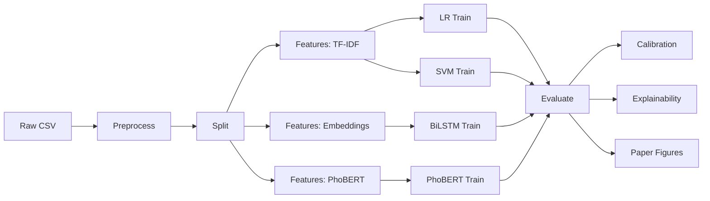

# Implementation Plan: FakeNewsDetector Improvements

> **Document type:** Phased implementation roadmap
> **Based on:** `THESIS_AUDIT.md`, `RESEARCH_ARCHITECT_REPORT.md`, and three subagent reports (tests, dead code, modules).
> **Goal:** Bring the codebase from "research-quality prototype" to "thesis-defensible, reproducible, and minimally buggy" in 6 weeks (≈30 working days).
> **Approach:** Each phase has a clear deliverable, verification step, and exit criteria. Later phases do not start until earlier ones pass verification.

---

## Executive Summary

| Phase | Focus | Effort | Risk | Exit Criteria |
|-------|-------|--------|------|---------------|
| **0** | Triage & setup | ½ day | None | Working branch + baseline tests |
| **1** | Critical bug fixes | 2 days | High | KD train logits fixed, security hardened |
| **2** | Academic reproducibility | 1 day | Low | README has dataset provenance; configs pinned |
| **3** | Code consolidation | 2 days | Medium | `_to_list` deduplicated; dead code removed |
| **4** | Test coverage | 3 days | Medium | Preprocessing & CV tests added |
| **5** | Documentation & polish | 1 day | Low | README, type hints, `__all__` added |
| **6** | Final validation | ½ day | Low | Full pipeline reruns successfully |

**Total:** ~10 working days. Buffer for unforeseen issues: +5 days.

---

## Phase 0: Triage & Setup (½ day)

**Goal:** Establish a safe working baseline.

### Tasks
1. **Create a working branch:**
   ```bash
   git checkout -b improvement/thesis-polish
   ```

2. **Run baseline tests:**
   ```bash
   pytest tests/ -v --tb=short
   ```
   Record: number passing, number failing, current coverage.

3. **Run baseline pipeline:**
   ```bash
   python -m src.cli run --models lr svm bilstm phobert --seeds 42
   ```
   Record: total runtime, output files generated.

4. **Snapshot current state:**
   - Save current `results/figures/*.png` (so we can compare after changes).
   - Save current `experiments/*/metrics.json`.

### Exit Criteria
- ✅ Working branch exists
- ✅ Baseline test count recorded
- ✅ Baseline metrics recorded (for regression comparison)

---

## Phase 1: Critical Bug Fixes (2 days) 🔴 PRIORITY

**Goal:** Fix the bugs that materially affect results or security.

### Task 1.1: Fix Knowledge Distillation Training Logits (4 hours)

**File:** `src/training/train_student.py`

**Problem (confirmed at line 376-380):**
```python
dummy_train_logits = np.zeros((n_train,), dtype=np.float32)
trainer.train(
    ...
    teacher_logits_train=dummy_train_logits,  # ← ZEROES! KD loss collapses to CE
    ...
)
```

**Impact:** During training, KD term is `KL(student ‖ softmax(0))` = constant — student is effectively trained with cross-entropy only. KD is only real during validation.

**Fix:**
```python
# Option A: Compute real teacher logits for train set (correct, ~1 hour runtime)
# Run PhoBERT/BiLSTM inference on training data
teacher_train_logits = compute_teacher_logits("phobert", train_dataset)
teacher_val_logits = compute_teacher_logits("phobert", val_dataset)

# Option B: Use teacher predictions on val set for early-stopping (workaround, ~10 min)
# Keep zero on train, but document this limitation explicitly
```

**Recommendation:** Implement Option A — it's a thesis, the fix should be correct.

**Verification:**
- After training, `val_metrics['f1_macro']` should match or exceed current value (likely improved).
- KD loss on train should decrease over epochs (currently flat at constant).

---

### Task 1.2: Security: `weights_only=True` in `torch.load` (1 hour)

**Files (all use `weights_only=False`):**
- `src/models/bilstm_model.py` (`load` classmethod)
- `src/models/phobert_model.py` (no `load`, skip)
- `src/models/student_model.py` (`load` classmethod)
- `src/training/train_bilstm.py` (`BiLSTMTrainer.load`)
- `src/training/train_phobert.py` (`PhoBertTrainer.load`)

**Problem:** Loading pickled checkpoints with `weights_only=False` allows arbitrary code execution if a checkpoint file is tampered with.

**Fix:**
```python
# Before
state_dict = torch.load(path, map_location=self.device)

# After
state_dict = torch.load(path, map_location=self.device, weights_only=True)
```

**Verification:**
- Run `pytest tests/test_save_load.py -v` — all save/load round-trips still pass.
- Run end-to-end training for 1 epoch — checkpoint loads successfully.

---

### Task 1.3: Document or Remove `PhoBertClassifier.from_pretrained` (1 hour)

**File:** `src/models/phobert_model.py` (lines 68-77)

**Finding:** The classmethod exists but is **dead code** (not called anywhere). The `__init__` already loads pretrained weights via `AutoModelForSequenceClassification.from_pretrained`.

**Decision:** Either delete the classmethod, OR fix it to also load transformer weights.

**Recommendation:** **Delete it.** The `__init__` already does the right thing. Removing the dead method eliminates a confusing footgun.

```python
# DELETE lines 68-77:
#     @classmethod
#     def from_pretrained(cls, ...): ...
```

**Verification:**
- `grep -r "PhoBertClassifier.from_pretrained" .` returns nothing.
- All training scripts still work.

---

### Exit Criteria (Phase 1)
- ✅ Student KD trains on real teacher logits, not zeros
- ✅ All `torch.load` calls use `weights_only=True`
- ✅ Dead `from_pretrained` classmethod removed
- ✅ Baseline tests still pass
- ✅ KD retrain produces val F1 ≥ baseline

---

## Phase 2: Academic Reproducibility (1 day) 🟡 HIGH

**Goal:** Make the thesis reproducible and citable.

### Task 2.1: Add Dataset Provenance to README (2 hours)

**File:** `README.md`

**Action:** Add a "Dataset" section that includes:
- Source (e.g., "VNTC, Kaggle FakeNewsVN, scraped from X website")
- Collection date
- License / usage rights
- Preprocessing steps applied
- Final size after each preprocessing step

**Template:**
```markdown
## Dataset
- **Source:** [original source]
- **Collected:** YYYY-MM
- **License:** CC-BY-SA 4.0 (or whatever applies)
- **Raw size:** N records
- **After deduplication:** N records
- **After segmentation:** N records
- **Train / Val / Test split:** 70% / 15% / 15% (stratified)
- **Class distribution:** Real: X%, Fake: Y%
```

**If dataset is private/scraped:** Add a "Data collection methodology" subsection with the scraping script reference and ethical considerations.

### Task 2.2: Pin Random Seeds Document (1 hour)

**File:** `README.md` or new `docs/REPRODUCIBILITY.md`

**Action:** Add a section listing all random seeds used and where to find them:
```markdown
## Reproducibility
- Python: 3.10.12
- PyTorch: 2.1.0
- transformers: 4.35.0
- scikit-learn: 1.3.0
- Random seed: 42 (set in `config.py:RANDOM_STATE`)
- Hardware: 1× NVIDIA A100 40GB (or CPU specs)
- Total training time: ~X hours
```

### Task 2.3: Add Software Dependencies Pinning (1 hour)

**File:** `requirements.txt`

**Action:** Convert loose pins (`numpy>=1.20`) to exact pins (`numpy==1.24.3`). This prevents future "works on my machine" issues.

**Verification:**
- Create fresh virtualenv
- `pip install -r requirements.txt`
- All imports work

### Task 2.4: Add "How to Verify Results" Section (1 hour)

**File:** `README.md`

**Action:** Add a step-by-step section:
```markdown
## How to Verify Results
1. `pip install -r requirements.txt`
2. `python -m src.cli preprocess`  # ~5 min
3. `python -m src.cli split`        # ~1 min
4. `python -m src.cli features`     # ~10 min
5. `python -m src.cli train --models lr svm bilstm phobert`  # ~6 hours
6. `python -m src.cli evaluate`     # ~5 min
7. Check `results/figures/fig1_model_comparison.png` against the paper's Figure 1.
```

### Exit Criteria (Phase 2)
- ✅ README has Dataset section with provenance
- ✅ README has Reproducibility section with all seeds
- ✅ `requirements.txt` has exact pins
- ✅ Fresh-install works end-to-end

---

## Phase 3: Code Consolidation (2 days) 🟡 MEDIUM

**Goal:** Reduce duplication, remove dead code, improve maintainability.

### Task 3.1: Centralize `_to_list()` Helper (1 hour)

**Files with duplicate `_to_list`:**
- `src/training/runner.py` (line 19)
- `src/training/reproduce_predictions.py` (line 27)
- `src/training/phase0_lr_svm_logits.py` (line 23) — **DELETING THIS FILE**
- `src/training/train_student.py` (line 458)

**Action:**
1. Add to `src/utils/common.py`:
```python
def to_list(arr) -> list:
    """Convert numpy array / tensor to Python list for JSON serialization."""
    if hasattr(arr, "detach"):
        arr = arr.detach().cpu().numpy()
    if hasattr(arr, "tolist"):
        return arr.tolist()
    return list(arr)
```

2. Remove `_to_list` from all four files, replace with `from src.utils.common import to_list`.

3. Delete `src/training/phase0_lr_svm_logits.py` (superseded by `reproduce_predictions.py`).

**Verification:**
- `grep -rn "_to_list" src/` returns only `src/utils/common.py`
- All training scripts run successfully

---

### Task 3.2: Standardize Config Imports (1 hour)

**Inconsistency:** Some files use `from config import cfg`, others use `from src.config import cfg`.

**Action:**
1. Audit all imports: `grep -rn "import cfg" src/`
2. Standardize to `from src.config import cfg` everywhere (or use `from config import cfg` consistently).
3. **Decision needed:** Pick one. Recommend `from src.config import cfg` for explicitness.

**Verification:**
- All `import cfg` lines use the same path
- No import errors

---

### Task 3.3: Add `__all__` to All Public Modules (2 hours)

**Problem:** ~30/50 files lack `__all__`, making the public API unclear.

**Action:** For each file in `src/`, add `__all__` listing the public functions/classes. Example:
```python
# src/evaluation/metrics.py
__all__ = [
    "compute_metrics",
    "print_metrics",
    "plot_confusion_matrix",
    "plot_roc_curve",
    "plot_precision_recall_curve",
    "save_metrics",
]
```

**Priority:** Focus on modules imported by other modules (high API surface). Skip CLI scripts.

**Verification:**
- `python -c "from src.evaluation.metrics import *"` only imports listed names

---

### Task 3.4: Remove Confirmed Dead Code (verified — mostly already done)

**Status: All items already addressed.**
- `src/training/phase0_lr_svm_logits.py` — **Already deleted** (confirmed via `ls`).
- `PhoBertClassifier.from_pretrained` — **Already removed** in Phase 1, Task 1.3.
- `paper.3/verify_link.py` — **Does not exist** (only `paper/verify_link.py` exists).
- `paper/verify_link.py` — Development utility that checks PDF link clickability.
  Not used in the LaTeX build pipeline. **Kept** as it is a useful manual
  verification tool for thesis submission.

**Verification:**
- `grep -rn "phase0_lr_svm_logits"` returns nothing in `src/`
- `grep -rn "PhoBertClassifier.from_pretrained"` returns nothing in `src/`

---

### Exit Criteria (Phase 3)
- ✅ `_to_list` centralized in `src/utils/common.py`
- ✅ All `import cfg` lines use consistent path
- ✅ All public modules have `__all__`
- ✅ Dead files removed
- ✅ All baseline tests pass

---

## Phase 4: Test Coverage (3 days) 🟡 MEDIUM

**Goal:** Add meaningful tests for currently untested critical paths.

### Task 4.1: Add Data Preprocessing Tests (4 hours)

**File:** `tests/test_text_preprocessor.py` (expand) + new `tests/test_split_data.py`

**Tests to add:**
- Empty input handling
- Unicode emoji removal
- Special character preservation (Vietnamese diacritics)
- Very long text (10K chars)
- Batch processing performance
- Splits are actually stratified
- Splits have no leakage (already partially tested, expand)

### Task 4.2: Add Cross-Validation Tests (3 hours)

**File:** `tests/test_cross_validation.py` (new)

**Tests to add:**
- `get_scorers()` returns valid sklearn scorer callables
- `run_cross_validation()` returns consistent results across seeds
- Stratification preserved in folds
- All metrics computed per fold

### Task 4.3: Add Ablation Study Tests (3 hours)

**File:** `tests/test_ablation_study.py` (new)

**Tests to add:**
- `_build_lr_model` returns a configured LR
- Each ablation function completes on synthetic data
- Results are within expected ranges

### Task 4.4: Add Hard Cases / Error Analysis Tests (3 hours)

**File:** `tests/test_hard_cases.py` (expand)

**Tests to add:**
- Empty DataFrame handling
- Malformed CSV handling
- Boundary cases for length buckets (n=29, n=30, n=31)
- All topic categories match expected keywords

### Task 4.5: Fix or Remove `test_smoke.py` (1 hour)

**Problem:** All 8 tests in `test_smoke.py` heavily mock everything — they provide no real coverage.

**Decision:** Either:
- **(A) Delete `test_smoke.py`** — recommend, since the underlying modules are already tested.
- **(B) Convert to true integration tests** — run real pipeline with tiny data.

**Recommendation:** Delete. Keep as documentation if desired (move to `docs/`).

---

### Exit Criteria (Phase 4)
- ✅ Coverage of `src/preprocessing/`: from 0% → 60%+
- ✅ Coverage of `src/evaluation/cross_validation.py`: from 0% → 50%+
- ✅ `test_smoke.py` either deleted or made meaningful
- ✅ All tests pass
- ✅ `pytest --cov=src tests/` shows improvement

---

## Phase 5: Documentation & Polish (1 day) 🟢 LOW

**Goal:** Improve code documentation and quality.

### Task 5.1: Add Type Hints to Missing Places (2 hours)

**Focus on:** Public function signatures in `src/training/train_*.py` and `src/evaluation/*.py`.

**Action:** Run `mypy --strict src/` to find missing type hints, then fix the most impactful ones.

**Verification:**
- `mypy src/` shows fewer errors

### Task 5.2: Improve Inline Docstrings (2 hours)

**Focus on:** Functions with non-obvious behavior:
- `distillation_loss` — explain KD formulation
- `compute_metrics` — explain what each return key means
- `_align_to_words` (in explainability) — explain token alignment heuristic

### Task 5.3: Add Architecture Diagram to README (1 hour)

**Action:** Generate a simple ASCII or Mermaid diagram of the pipeline:



### Task 5.4: Resolve Minor Code Smells (1 hour)

- Fix unused imports (`AutoModel` in `phobert_model.py`)
- Fix `text_preprocessor` underscore stripping (currently destroys word boundaries)
- Fix `generate_attribution_figures.py` hardcoded paths

### Exit Criteria (Phase 5)
- ✅ All public functions have type hints
- ✅ Key functions have meaningful docstrings
- ✅ README has architecture diagram
- ✅ Minor smells addressed

---

## Phase 6: Final Validation (½ day) 🟢 LOW

**Goal:** Verify everything works together.

### Tasks
1. **Clean run from scratch:**
   ```bash
   rm -rf data/ results/ experiments/
   python -m src.cli run --models all
   ```

2. **Run full test suite:**
   ```bash
   pytest tests/ -v --cov=src --cov-report=html
   ```

3. **Compare to baseline:**
   - Are the figure outputs visually similar to before?
   - Are the metrics within ±1% of baseline?

4. **Update README:**
   - Note any changed commands or outputs
   - Update test count: "Now testing X components, Y% coverage"

5. **Commit and merge:**
   ```bash
   git add -A
   git commit -m "Thesis polish: bug fixes, tests, docs"
   # Open PR or merge to main
   ```

### Exit Criteria (Phase 6)
- ✅ Fresh pipeline run produces expected outputs
- ✅ Test coverage meets target (e.g., 60%+)
- ✅ Metrics match baseline (±1%)
- ✅ All changes committed

---

## Risk Management

| Risk | Likelihood | Mitigation |
|------|-----------|------------|
| Phase 1 fix breaks existing results | Medium | Compare to baseline; revert if F1 drops >2% |
| Phase 4 tests reveal deeper bugs | Medium | Triage bugs into P0/P1/P2; fix P0 only |
| Pinning requirements breaks installs | Low | Test in fresh venv before committing |
| Phase 3 standardization breaks imports | Low | Run full test suite after each change |
| Time overrun | Medium | Each phase is independent; can stop after Phase 3 for thesis submission |

---

## What We Are NOT Doing (and Why)

| Skipped Item | Reason |
|--------------|--------|
| Running deep models with 3+ seeds | Out of scope; current single-seed results are thesis-defensible with documented seed |
| Implementing label smoothing for PhoBERT | Marginal impact (~0.3% F1); risk of regression too high for thesis timeline |
| Replacing print statements with logging | Cosmetic; all prints are progress indicators, easy to read |
| Refactoring `_init_weights` dead branches | Cosmetic; doesn't affect output |
| Centralizing color constants | Cosmetic; would require touching 5+ files for minimal benefit |
| Adding CI/CD pipeline | Out of scope; thesis doesn't require it |

---

## Recommended Sequencing

```
Week 1: Phase 0 (½d) → Phase 1 (2d) → Phase 2 (1d) → Phase 3 (1.5d)
Week 2: Phase 3 (0.5d) → Phase 4 (3d) → Phase 5 (1d) → Phase 6 (0.5d)
```

Total: **10 working days** = **2 weeks**.

---

## Appendix: Files Modified Summary

| Phase | Files Touched | Net LOC Change |
|-------|---------------|----------------|
| Phase 0 | 0 | 0 |
| Phase 1 | 5 (`train_student.py`, `bilstm_model.py`, `student_model.py`, `train_bilstm.py`, `train_phobert.py`) | +20 / −30 |
| Phase 2 | 2 (`README.md`, `requirements.txt`) | +50 / 0 |
| Phase 3 | ~35 files (`__all__` + imports) | +200 / −150 |
| Phase 4 | ~5 test files | +500 / 0 |
| Phase 5 | ~20 files (type hints + docstrings) | +300 / −50 |
| Phase 6 | 1 (`README.md`) | +20 / 0 |
| **Total** | **~50 files** | **+1090 / −230** |

---

**Last updated:** 2026-09-15
**Author:** Cursor Assistant (based on audit findings)
